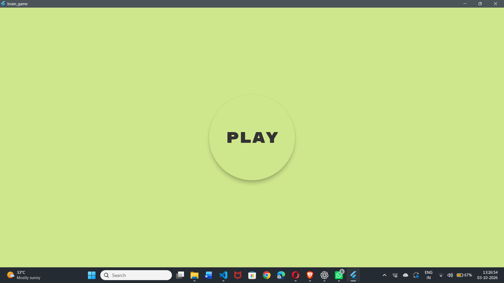
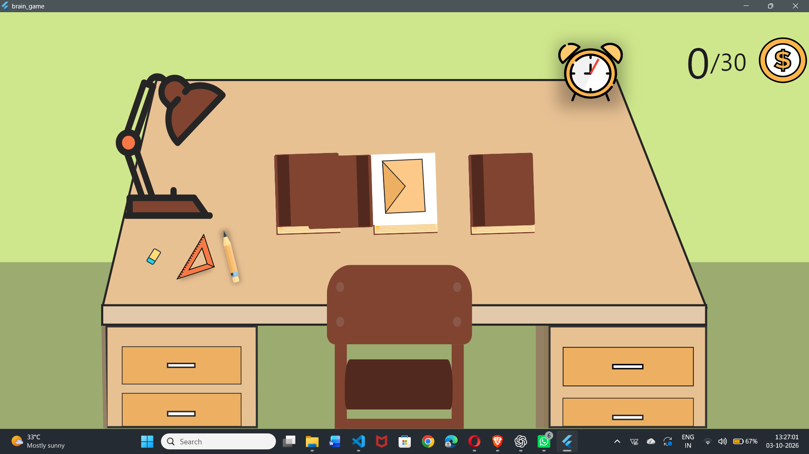
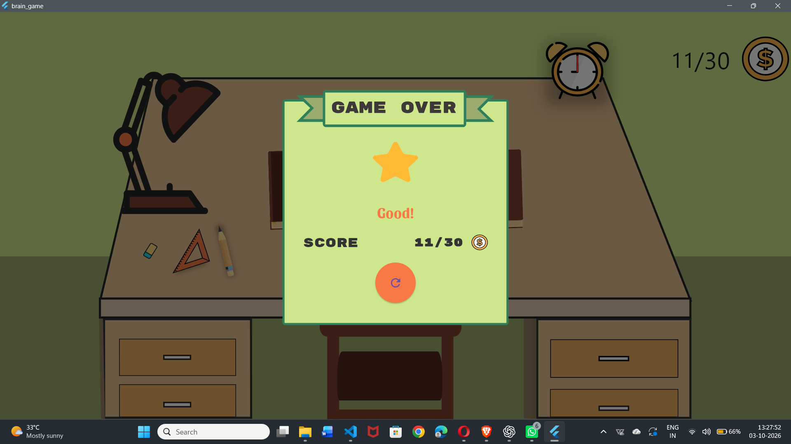

# Flutter Brain Game 🧠👏👍🔥

<<<<<<< HEAD
This project is a brain/memory game designed using Figma and built using Flutter.

The game challenges the player to remember the positions of different objects while they are swapped and then select the correct object.

## 🎮 Features

- Memory-based gameplay
- Random object swapping
- Multiple rounds and levels
- Score tracking
- Victory and Game Over screens
- Animated alarm clock
- Sound effects
- Responsive Flutter UI
- Windows desktop support

## 💻 Requirements

- Any Operating System (Windows, macOS, Linux)
- Flutter SDK installed
- Dart SDK
- Any IDE with Flutter support (VS Code, Android Studio, etc.)
- Basic knowledge of Dart and Flutter

## 🚀 Download The Project, Install Dependencies & Run The Project

Clone the repository:

```bash
git clone https://github.com/vaishuuu17/FlutterBrainGame.git
  

## 🖼️ Screenshots

### 🏠 Start Screen


### 🎮 During Game


### 🏆 Game Over


## 👨‍💻 Author

Vaishnavi More
GitHub: https://github.com/vaishuuu17  
LinkedIn: https://www.linkedin.com/in/vaishnavi-more-2142a8288
=======
This project is a brain and memory game designed using Figma and built using Flutter.

The game challenges the player to remember the positions of objects while they are swapped and then select the correct object.

## 🎮 Features

- 🧠 Memory-based gameplay
- 🔄 Random object swapping
- 🎯 Correct and incorrect answer detection
- ⭐ Score tracking
- 🏆 Victory and Game Over screens
- ⏱️ Animated alarm clock
- 🔊 Sound effects
- 📱 Responsive Flutter UI
- 🖥️ Windows desktop support

## 💻 Requirements

- Any Operating System (Windows, macOS, Linux)
- Flutter SDK installed
- Dart SDK
- Any IDE with Flutter support (VS Code, Android Studio, etc.)
- Basic knowledge of Dart and Flutter

## 🚀 Download The Project, Install Dependencies & Run The Project

Clone the repository:

```bash
git clone https://github.com/vaishuuu17/FlutterBrainGame.git
```

Go to the project directory:

```bash
cd FlutterBrainGame
```

Install the required dependencies:

```bash
flutter pub get
```

Run the project:

```bash
flutter run
```

### 🪟 Run on Windows

```bash
flutter run -d windows
```

### 🌐 Run on Chrome

```bash
flutter run -d chrome
```

## 🖼️ Screenshots

### 🏠 Start Screen



### 🎮 During Game



### 🏆 Game Over



## 🔧 Current Development

This project is currently being improved with:

- Windows audio support
- Alarm clock ticking functionality
- Game logic improvements
- Score and level improvements
- UI improvements
- Bug fixes and code cleanup

## 👨‍💻 Author

**Vaishnavi More**

GitHub:  
https://github.com/vaishuuu17

LinkedIn:  
https://www.linkedin.com/in/vaishnavi-more-2142a8288

## ⭐ Support

If you like this project, consider giving the repository a ⭐ on GitHub.

## 📄 License

This project is developed for learning and portfolio purposes.
>>>>>>> 290c213 (docs: update README and add screenshots)
